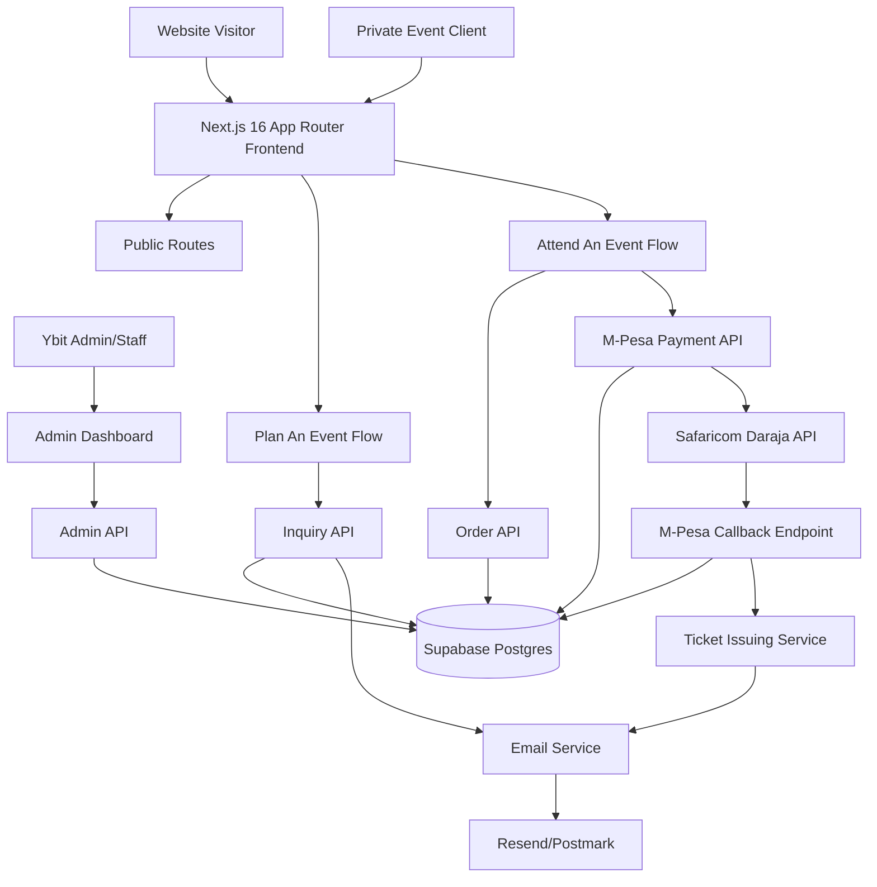
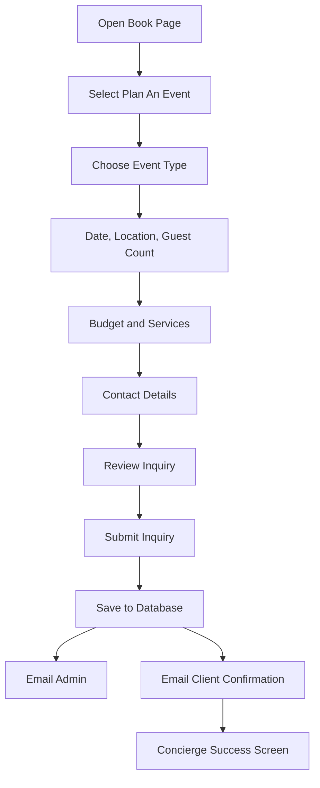
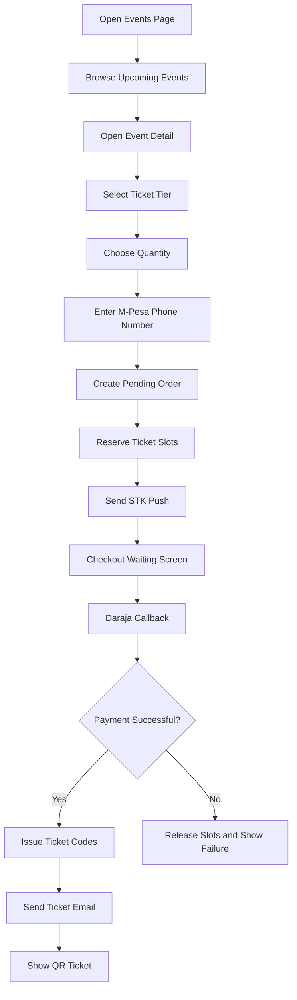
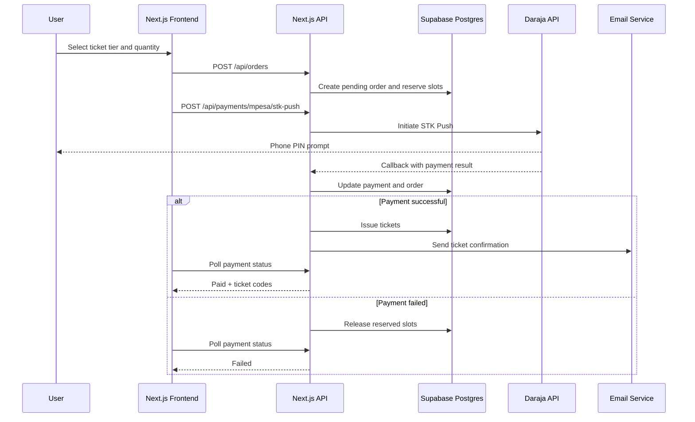
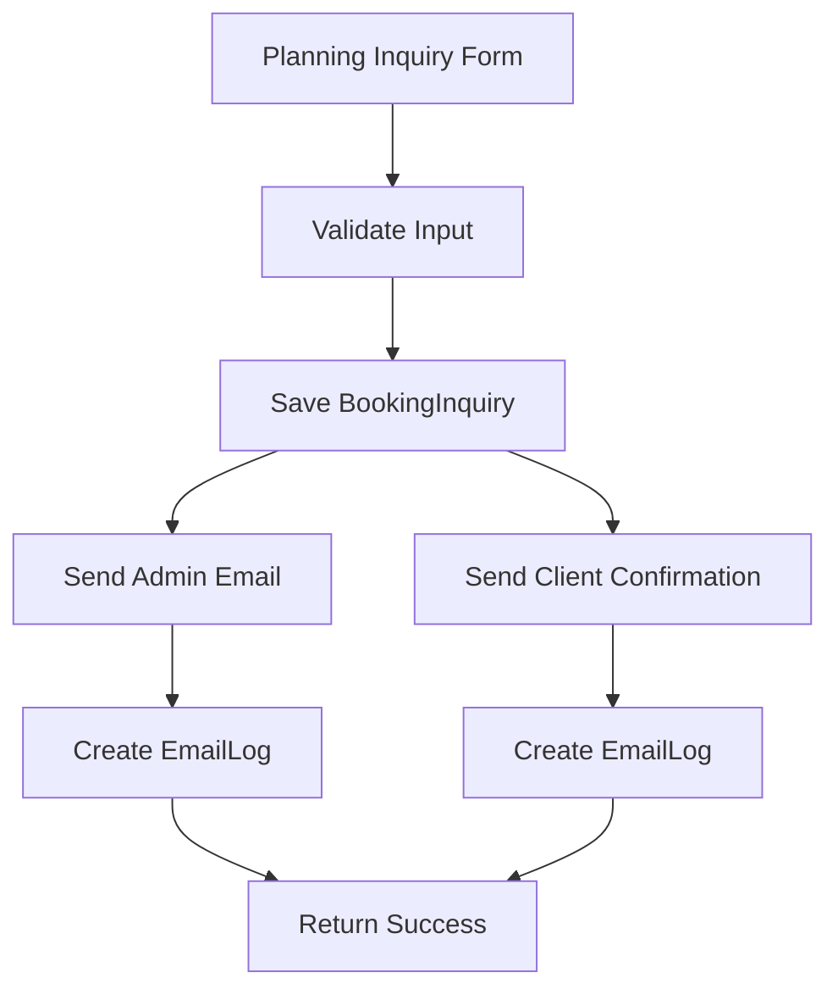
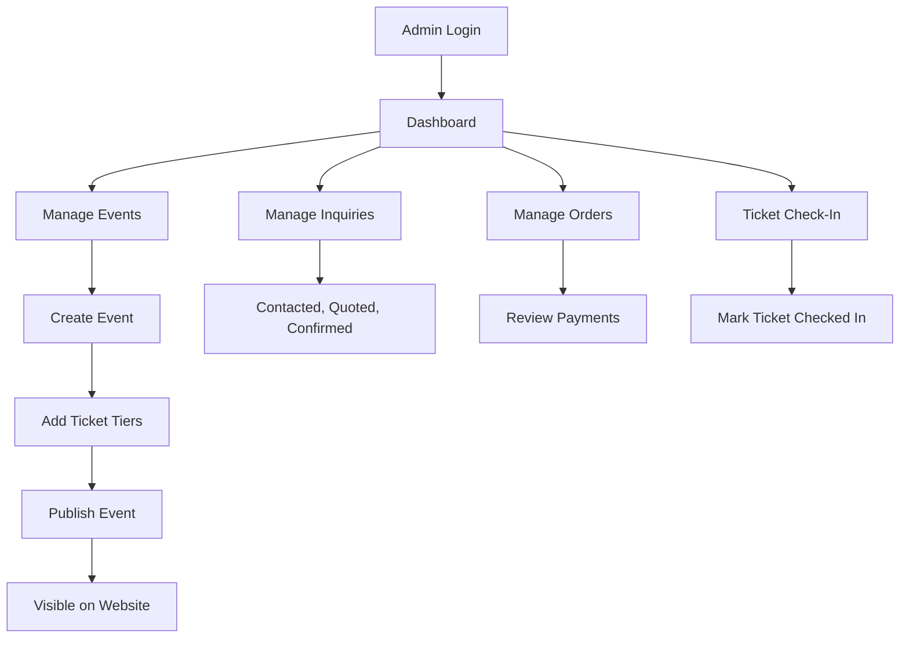

# Ybit Entertainment Website Architecture

## 1. Project Vision

Ybit Entertainment is a premium event organizing group founded on **25 August 2019** and based in **Westlands, Nairobi**.

The website should grow beyond a simple portfolio into a polished event platform with two clear user journeys:

1. **Plan An Event**: clients hire Ybit for weddings, birthdays, private celebrations, festivals, corporate activations, and full event production.
2. **Attend An Event**: visitors browse public Ybit events, view ticket tiers, pay with M-Pesa, and receive digital tickets.

The visual direction should remain cinematic, premium, dark-mode first, image-led, and inspired by high-end event, photography, luxury hospitality, and Awwwards-style editorial websites.

## 2. Experience Principles

- Lead with event photography and atmosphere rather than generic service cards.
- Keep copy short, editorial, confident, and emotionally clear.
- Use motion intentionally: slow reveals, subtle parallax, image masks, horizontal galleries, and restrained hover effects.
- Treat pricing as premium **access tiers**, not cheap pricing boxes.
- Treat private event inquiries as concierge requests, not basic contact forms.
- Make M-Pesa checkout feel native, fast, and trusted for Kenyan users.
- Keep the first version elegant and stable, then expand toward a full event management platform.

## 3. High-Level Architecture



## 4. Recommended Technology Stack

### Frontend

- **Next.js 16 App Router**: page routing, layouts, metadata, server components, and API routes.
- **React 19**: component UI.
- **TypeScript 5**: type safety across frontend and backend code.
- **Tailwind CSS v4**: design system tokens, layout, spacing, and responsive styling.
- **Framer Motion**: premium scroll reveals, image transitions, microinteractions, and route-level motion.
- **Lucide React**: icons for controls and interface actions.

### Backend

- **Next.js Route Handlers / Server Actions**: API layer for inquiries, orders, payments, tickets, and admin operations.
- **Supabase Postgres**: primary database.
- **Prisma ORM**: typed database schema, migrations, and clean query layer.
- **Supabase Storage**: event images, gallery assets, ticket QR images if needed, and admin-uploaded media.
- **Supabase Auth**: admin authentication and role-based access.

### Payments

- **Safaricom Daraja M-Pesa Express STK Push**: primary payment method for tickets and event deposits.
- **Daraja callback endpoint**: source of truth for payment completion.
- **Manual Paybill/C2B callback**: optional later fallback for manual payments and reconciliation.

### Email

- **Resend** or **Postmark**: transactional emails for inquiries, ticket confirmations, admin alerts, and receipts.

### Optional Later Integrations

- WhatsApp notifications for ticket confirmations and inquiry follow-up.
- SMS provider for payment/ticket reminders.
- Analytics with PostHog, Vercel Analytics, or Plausible.
- CMS layer using a custom admin dashboard or a headless CMS if content volume grows.

## 5. Route Architecture

```txt
/
/weddings
/festivals
/birthdays
/corporate
/gallery
/about
/book
/events
/events/[slug]
/checkout/[orderId]
/ticket/[ticketCode]
/admin
/admin/events
/admin/events/[id]
/admin/orders
/admin/inquiries
/admin/tickets
```

### Public Pages

- `/`: cinematic homepage, experience categories, featured work, process, testimonials, and CTA.
- `/weddings`: wedding planning, gallery, packages, process, inquiry CTA.
- `/festivals`: festival production, music/events energy, public event links, ticket CTA.
- `/birthdays`: private celebrations, birthday packages, gallery, inquiry CTA.
- `/corporate`: corporate activations, launches, brand events, production services.
- `/gallery`: filterable event archive.
- `/about`: origin story, founded date, Westlands location, mission, team/process.
- `/book`: tabbed booking page with `Plan An Event` and `Attend An Event`.
- `/events`: upcoming public events.
- `/events/[slug]`: event detail, access tiers, ticket selection, M-Pesa checkout entry.
- `/checkout/[orderId]`: payment waiting room and status confirmation.
- `/ticket/[ticketCode]`: ticket view with QR/access code.

### Admin Pages

- `/admin`: dashboard overview.
- `/admin/events`: create and manage public events.
- `/admin/events/[id]`: edit event details, images, ticket tiers, sale windows.
- `/admin/orders`: view purchases and payment statuses.
- `/admin/inquiries`: manage planning inquiries.
- `/admin/tickets`: search tickets and check-in status.

## 6. Frontend Component Architecture

```txt
app/
  layout.tsx
  page.tsx
  weddings/page.tsx
  festivals/page.tsx
  birthdays/page.tsx
  corporate/page.tsx
  gallery/page.tsx
  about/page.tsx
  book/page.tsx
  events/page.tsx
  events/[slug]/page.tsx
  checkout/[orderId]/page.tsx
  ticket/[ticketCode]/page.tsx

components/
  layout/
    SiteHeader.tsx
    MobileMenu.tsx
    SiteFooter.tsx
  sections/
    CinematicHero.tsx
    ExperienceCategories.tsx
    FeaturedWork.tsx
    MosaicGallery.tsx
    ProcessTimeline.tsx
    Testimonials.tsx
    FinalCTA.tsx
    PlanningPackages.tsx
    UpcomingEvents.tsx
  booking/
    BookingTabs.tsx
    PlanningInquiryForm.tsx
    EventTypeStep.tsx
    BudgetStep.tsx
    ContactStep.tsx
  tickets/
    EventCard.tsx
    TicketTierList.tsx
    TicketTierRow.tsx
    CheckoutPanel.tsx
    PaymentWaitingState.tsx
    TicketQRCode.tsx
  admin/
    AdminShell.tsx
    EventEditor.tsx
    TicketTierEditor.tsx
    InquiryTable.tsx
    OrderTable.tsx
```

## 7. Booking UX

The booking page should use a premium tab switch:

```txt
[ Plan An Event ] [ Attend An Event ]
```

### Plan An Event

This flow is for clients hiring Ybit.

Recommended fields:

- Name
- Email
- Phone
- Event type
- Preferred date
- Location
- Guest count
- Budget range
- Services needed
- Message

Flow:



### Attend An Event

This flow is for visitors buying tickets.

Recommended event card data:

- Event title
- Hero image
- Date and time
- Venue
- Location
- Category
- Status
- Starting price
- Available slots

Flow:



## 8. Pricing Architecture

### Planning Service Packages

Planning packages should guide expectations without locking Ybit into rigid pricing.

Suggested structure:

| Package | Best For | Pricing Style |
| --- | --- | --- |
| Essential Planning | Small birthdays, intimate private events | From KSh |
| Signature Production | Weddings, premium birthdays, corporate events | From KSh |
| Full Experience Design | Large weddings, festivals, high-touch productions | Custom Quote |

Planning package pages should include:

- Starting price or custom quote label.
- What is included.
- What can be added.
- Consultation CTA.
- Gallery proof.

### Public Ticket Tiers

Ticket tiers should feel like access bands.

Suggested tiers:

| Tier | Use Case |
| --- | --- |
| Early Bird | Limited early purchase discount |
| Regular | Standard admission |
| VIP | Priority entry, lounge, better seating, perks |
| VVIP/Table | Group reservation, table service, premium access |
| Couple/Group Pass | Bundled access for selected events |

Ticket row UI:

```txt
EARLY BIRD    Limited entry access       KSh 1,500     23 left      Select
VIP ACCESS    Lounge + priority entry    KSh 5,000     12 left      Select
VVIP TABLE    Table reservation          KSh 25,000    3 left       Enquire
```

## 9. Backend Service Architecture

```txt
lib/
  db/
    prisma.ts
  services/
    eventService.ts
    inquiryService.ts
    orderService.ts
    paymentService.ts
    ticketService.ts
    emailService.ts
  validators/
    inquirySchema.ts
    orderSchema.ts
    eventSchema.ts
  mpesa/
    auth.ts
    stkPush.ts
    callback.ts
    query.ts
  email/
    templates/
      inquiryAdmin.tsx
      inquiryClient.tsx
      ticketConfirmation.tsx
      paymentReceipt.tsx
```

### API Routes

```txt
POST /api/inquiries
GET  /api/events
GET  /api/events/[slug]
POST /api/orders
POST /api/payments/mpesa/stk-push
POST /api/payments/mpesa/callback
GET  /api/payments/[orderId]/status
GET  /api/tickets/[ticketCode]
POST /api/admin/events
PATCH /api/admin/events/[id]
POST /api/admin/ticket-tiers
PATCH /api/admin/ticket-tiers/[id]
```

## 10. Database Schema Design

Recommended database: **Supabase Postgres** managed through **Prisma**.

### Core Models

```prisma
model Event {
  id          String      @id @default(cuid())
  slug        String      @unique
  title       String
  category    EventCategory
  description String
  venue       String?
  location    String?
  startsAt    DateTime?
  endsAt      DateTime?
  heroImage   String?
  status      EventStatus @default(DRAFT)
  tiers       TicketTier[]
  orders      Order[]
  tickets     Ticket[]
  createdAt   DateTime    @default(now())
  updatedAt   DateTime    @updatedAt
}

model TicketTier {
  id          String   @id @default(cuid())
  eventId     String
  event       Event    @relation(fields: [eventId], references: [id], onDelete: Cascade)
  name        String
  description String?
  price       Int
  currency    String   @default("KES")
  capacity    Int
  sold        Int      @default(0)
  reserved    Int      @default(0)
  saleStartsAt DateTime?
  saleEndsAt   DateTime?
  benefits    String[]
  isActive    Boolean  @default(true)
  createdAt   DateTime @default(now())
  updatedAt   DateTime @updatedAt
}

model Order {
  id          String      @id @default(cuid())
  eventId     String
  event       Event       @relation(fields: [eventId], references: [id])
  customerName  String?
  customerEmail String?
  customerPhone String
  status      OrderStatus @default(PENDING)
  totalAmount Int
  currency    String      @default("KES")
  expiresAt   DateTime?
  payments    Payment[]
  tickets     Ticket[]
  createdAt   DateTime    @default(now())
  updatedAt   DateTime    @updatedAt
}

model Payment {
  id                    String        @id @default(cuid())
  orderId               String
  order                 Order         @relation(fields: [orderId], references: [id])
  provider              PaymentProvider @default(MPESA)
  status                PaymentStatus @default(INITIATED)
  amount                Int
  phone                 String
  merchantRequestId     String?
  checkoutRequestId     String?
  mpesaReceiptNumber    String?
  resultCode            String?
  resultDescription     String?
  rawCallback           Json?
  createdAt             DateTime      @default(now())
  updatedAt             DateTime      @updatedAt
}

model Ticket {
  id          String       @id @default(cuid())
  eventId     String
  event       Event        @relation(fields: [eventId], references: [id])
  orderId     String
  order       Order        @relation(fields: [orderId], references: [id])
  tierName    String
  ticketCode  String       @unique
  qrPayload   String
  status      TicketStatus @default(RESERVED)
  checkedInAt DateTime?
  createdAt   DateTime     @default(now())
  updatedAt   DateTime     @updatedAt
}

model BookingInquiry {
  id          String        @id @default(cuid())
  name        String
  email       String
  phone       String
  eventType   EventCategory
  eventDate   DateTime?
  location    String?
  guestCount  Int?
  budgetRange String?
  services    String[]
  message     String?
  status      InquiryStatus @default(NEW)
  createdAt   DateTime      @default(now())
  updatedAt   DateTime      @updatedAt
}

model EmailLog {
  id          String   @id @default(cuid())
  to          String
  subject     String
  provider    String
  status      String
  relatedType String?
  relatedId   String?
  createdAt   DateTime @default(now())
}
```

### Enums

```prisma
enum EventCategory {
  WEDDING
  FESTIVAL
  BIRTHDAY
  CORPORATE
  PRIVATE
}

enum EventStatus {
  DRAFT
  PUBLISHED
  SOLD_OUT
  PAST
  CANCELLED
}

enum OrderStatus {
  PENDING
  AWAITING_PAYMENT
  PAID
  EXPIRED
  CANCELLED
}

enum PaymentProvider {
  MPESA
}

enum PaymentStatus {
  INITIATED
  PROCESSING
  SUCCESSFUL
  FAILED
  TIMEOUT
}

enum TicketStatus {
  RESERVED
  ISSUED
  CHECKED_IN
  CANCELLED
}

enum InquiryStatus {
  NEW
  CONTACTED
  QUOTED
  CONFIRMED
  CLOSED
}
```

## 11. M-Pesa Daraja Integration

Use **M-Pesa Express STK Push** for ticket purchases and private event deposits.

### Environment Variables

```txt
MPESA_ENV=sandbox
MPESA_CONSUMER_KEY=
MPESA_CONSUMER_SECRET=
MPESA_SHORTCODE=
MPESA_PASSKEY=
MPESA_CALLBACK_URL=
MPESA_TRANSACTION_TYPE=CustomerPayBillOnline
```

### STK Push Flow



### Important Rules

- Never expose Daraja credentials to the browser.
- Treat the Daraja callback as the source of truth.
- Keep the checkout page polling order/payment status.
- Reserve ticket inventory for a short window, such as 5 to 10 minutes.
- Release reserved inventory when payment fails or the order expires.
- Store raw callback payloads for reconciliation and debugging.

## 12. Email System

Use transactional email for:

- New planning inquiry admin notification.
- Planning inquiry client confirmation.
- Successful ticket purchase confirmation.
- Payment receipt.
- VIP/VVIP table inquiry notification.
- Low ticket inventory alerts.

### Environment Variables

```txt
RESEND_API_KEY=
EMAIL_FROM="Ybit Entertainment <bookings@ybitentertainment.com>"
EMAIL_ADMIN="info@ybitentertainment.com"
```

### Inquiry Email Flow



## 13. Admin Workflow

Phase-one admin can be simple and practical.



Admin capabilities:

- Create/edit public events.
- Upload event images.
- Create ticket tiers.
- Set capacity, pricing, and sale windows.
- View inquiries and update status.
- View orders and payments.
- Search ticket by code.
- Mark tickets as checked in.

## 14. Security And Reliability

- Validate all API inputs with Zod or a similar schema validator.
- Use Supabase Auth for admin access.
- Keep payment endpoints server-only.
- Make callback endpoints idempotent using `checkoutRequestId` and `merchantRequestId`.
- Avoid issuing duplicate tickets if Daraja retries callbacks.
- Use database transactions for order/payment/ticket updates.
- Rate-limit public inquiry and payment initiation endpoints.
- Log payment and email failures for admin review.
- Do not trust frontend price values; calculate totals on the backend from `TicketTier`.

## 15. Implementation Roadmap

### Phase 1: Premium Public Website

1. Define design tokens from the Stitch design system.
2. Build global layout, navigation, footer, and typography.
3. Build homepage sections.
4. Build category pages: weddings, festivals, birthdays, corporate.
5. Build gallery and about pages.
6. Add polished motion and responsive behavior.

### Phase 2: Inquiry And Email Backend

1. Configure Supabase project.
2. Add Prisma and database schema.
3. Build `BookingInquiry` model and API.
4. Build `Plan An Event` multi-step form.
5. Add Resend/Postmark transactional emails.
6. Store email logs.

### Phase 3: Public Events And Tickets

1. Add `Event` and `TicketTier` models.
2. Build `/events` listing page.
3. Build `/events/[slug]` detail page.
4. Build ticket tier selection UI.
5. Create pending orders and reserve ticket slots.

### Phase 4: M-Pesa Checkout

1. Configure Daraja sandbox credentials.
2. Build M-Pesa auth token helper.
3. Build STK Push API route.
4. Build Daraja callback route.
5. Add checkout waiting screen.
6. Issue ticket codes after successful payment.
7. Send ticket confirmation emails.

### Phase 5: Admin Dashboard

1. Add Supabase Auth.
2. Build admin layout.
3. Add event creation/editing.
4. Add ticket tier management.
5. Add inquiry management.
6. Add order/payment/ticket views.
7. Add check-in flow.

### Phase 6: Premium Platform Enhancements

1. Add QR code scanning.
2. Add WhatsApp/SMS notifications.
3. Add coupons and guest lists.
4. Add waitlist for sold-out events.
5. Add case studies for past events.
6. Add analytics and reporting.
7. Add CMS/media management improvements.

## 16. Recommended First Build Order

```txt
1. Design tokens and layout
2. Homepage
3. Category pages
4. Booking inquiry form
5. Supabase + Prisma setup
6. Inquiry API + email
7. Events and ticket tiers
8. Order creation
9. M-Pesa STK Push
10. Payment callback
11. Ticket generation
12. Admin dashboard
```

## 17. Open Decisions

Before implementation, confirm these:

- Final domain and sender email address.
- Whether Ybit has an active M-Pesa Paybill/Till number.
- Whether ticket confirmation should be email-only first or email plus WhatsApp/SMS.
- Whether admin login should be restricted to specific emails.
- Whether public ticket QR scanning is needed in version one or can come after launch.
- Whether planning packages should show real starting prices or only `Custom Quote`.

